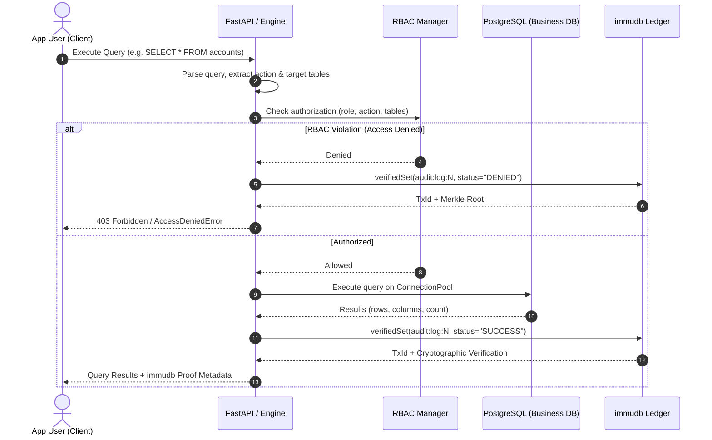

# VaultDB System Architecture

> **Cryptographically Immutable Database Middleware with PostgreSQL & immudb**

VaultDB is a compliance and auditing database middleware layer designed to provide **zero-trust immutability**, **role-based access control (RBAC)**, and **cryptographic verification** for critical data operations (meeting standards such as GDPR Art. 30 and HIPAA §164.312).

---

## 1. Problem Statement & Why immudb?

### The Traditional PostgreSQL Flaw
In conventional relational database systems, audit logs stored in standard SQL tables (even with restricted database permissions or triggers) remain vulnerable to:
1. **DBA / Superuser Tampering**: A user with `postgres` superuser privileges can easily disable triggers, execute `DELETE FROM vault_audit.audit_logs`, or modify write-ahead logs (WAL).
2. **Lack of Cryptographic Verification**: Relational rows do not produce verifiable cryptographic state proofs. An external compliance auditor cannot mathematically verify if a log record was modified after the fact.

### The immudb Immutability Solution
**immudb** is a lightweight, high-performance, cryptographic immutable ledger.
- **Append-Only Merkle Trees**: Every state transition in immudb calculates a cryptographic digest (SHA-256) committed to an append-only Merkle tree.
- **Cryptographic Tamper-Evidence**: Even system administrators cannot alter or delete committed history without breaking the cryptographic Merkle root hash.
- **Zero-Trust Proofs (`verifiedSet` / `verifiedGet`)**: The client cryptographically validates inclusion proofs directly with the ledger engine upon every read and write.

---

## 2. System Architecture Diagram

```
+-----------------------------------------------------------------------------------+
|                                Client Applications                                |
|          (Web Dashboard, REST Consumers, Microservices, Python SDK)               |
+------------------------------------------+----------------------------------------+
                                           |
                                           v
+-----------------------------------------------------------------------------------+
|                                VaultDB Middleware                                 |
|                                                                                   |
|   1. SQL Parser & Inspector        2. RBAC Policy Engine                          |
|      - Extract DDL/DML actions        - Enforces Customer / Employee / Admin      |
|      - Detect sensitive fields        - Throws AccessDeniedError if forbidden     |
|                                                                                   |
|                         3. VaultEngine Orchestrator                               |
+---------------------+-------------------------------------+-----------------------+
                      |                                     |
                      v                                     v
+-----------------------------------+ +---------------------------------------------+
|    PostgreSQL Relational Store    | |          immudb Cryptographic Ledger        |
|                                   | |                                             |
|  - ConnectionPool (psycopg-pool)  | |  - Append-Only Merkle Tree                  |
|  - Business Data:                 | |  - Cryptographically Verified Audit Trail   |
|      app_data.users               | |  - Linear Tx Height & Merkle Root Hash      |
|      app_data.accounts            | |  - Zero-Trust Proof Verification            |
|      app_data.transactions        | |                                             |
+-----------------------------------+ +---------------------------------------------+
```

---

## 3. Query Execution & Auditing Lifecycle



---

## 4. Scalability Architecture

To satisfy enterprise-grade scalability requirements:

1. **Connection Pooling (`psycopg_pool.ConnectionPool`)**:
   - Reusable database connection pool (`POSTGRES_POOL_MIN=2`, `POSTGRES_POOL_MAX=10`).
   - Prevents database connection exhaustion under heavy concurrent query spikes.
2. **Asynchronous Non-Blocking Web API (`FastAPI` + `Uvicorn`)**:
   - High-throughput asynchronous request loop handling concurrent HTTP clients.
   - Built-in interactive OpenAPI/Swagger documentation at `/docs`.
3. **Layered Separation of Concerns**:
   - `config/`: 12-factor configuration reading environment variables.
   - `src/vault_db/core/`: Stateless parsers and RBAC business logic.
   - `src/vault_db/storage/`: Dedicated adapters for PostgreSQL and immudb.
   - `src/vault_db/api/`: REST routing and Pydantic serialization.
   - `scripts/`: Operational tools for initialization, background service lifecycle, and CLI auditing.

---

## 5. Role-Based Access Control (RBAC) Matrix

| Table | Action | Customer | Employee | Admin |
| :--- | :--- | :---: | :---: | :---: |
| `accounts` | `SELECT` | Allowed | Allowed | Allowed |
| `accounts` | `INSERT`, `UPDATE`, `DELETE` | Forbidden | Forbidden | Allowed |
| `transactions` | `SELECT` | Allowed | Allowed | Allowed |
| `transactions` | `INSERT`, `UPDATE` | Forbidden | Allowed | Allowed |
| `users` | `SELECT`, `INSERT`, `UPDATE`, `DELETE` | Forbidden | Forbidden | Allowed |
| Any Table | `DDL:DROP`, `ALTER`, `TRUNCATE` | Forbidden | Forbidden | Allowed |

---

## 6. Viva & Presentation Questions

### Q1: Why not just store audit logs in a PostgreSQL table with triggers?
**Answer:** PostgreSQL is an updateable relational engine. A database administrator (`postgres` superuser) or an attacker who gains root/DBA access can disable triggers (`ALTER TABLE ... DISABLE TRIGGER ALL`), modify audit rows, delete audit trails, or truncate the table. In contrast, immudb uses an immutable append-only ledger backed by cryptographic Merkle trees. Even root/admin credentials cannot modify past transactions without corrupting the cryptographic tree hash.

### Q2: What is the cryptographic proof generated by immudb?
**Answer:** Whenever an audit log is committed via `verifiedSet`, immudb calculates a cryptographic digest (Merkle root hash). When querying via `verifiedGet`, the client receives a Merkle membership proof demonstrating that the log entry is part of the certified root hash at that transaction height.

### Q3: How is this architecture scalable?
**Answer:** The architecture employs PostgreSQL connection pooling (`psycopg_pool`) to eliminate the overhead of per-query TCP handshakes, a high-concurrency asynchronous API server (`FastAPI` + `Uvicorn`), clean thread-safe immudb session management, and a decoupled layered architecture allowing independent horizontal scaling.
